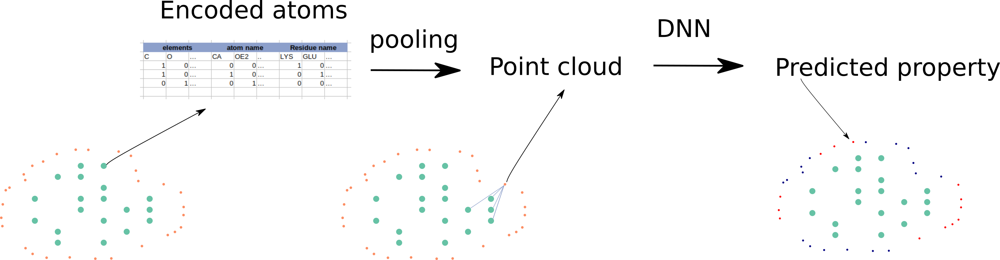

# Protein surface

# Abstract 

The properties of the protein surface are crucial for interaction of the protein with other objects: small molecules, antibodies, othe proteins. 
There physical-based methods (and software) for prediction hydrophobicity, partial charges, surface accessible area using general laws of physic 
for estimation these parameters. 

The aim of the work is creating the DNN for prediction hydrophobicity/partial charges using solely information from the PDB file: elements name, atom names, residue names.
The method is inspired by a few noticable methods for protein-protein interaction prediction:
- MaSiF [link](https://github.com/LPDI-EPFL/masif) 
- PeSTo [link](https://github.com/LBM-EPFL/PeSTo) 
- dMaSIF [link](https://github.com/FreyrS/dMaSIF)

# Method 

